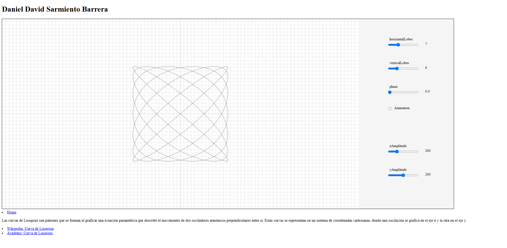

# Lissajous Curves Visualization

This project demonstrates the concept of Lissajous curves and serves static files using an Express.js server. 


## 📚 What are Lissajous Curves?

Lissajous curves are a family of complex patterns that are the result of the parametric equations:

x(t) = A * sin(a * t + δ), y(t) = B * sin(b * t)

- **A** and **B** are the amplitudes.
- **a** and **b** determine the frequencies of the motion.
- **δ** is the phase difference.

These curves can represent harmonic motion and are often visualized on oscilloscopes to analyze signal frequencies.


## 🚀 How to Run the Project

### 1. Prerequisites

Make sure you have [Node.js](https://nodejs.org/) installed. Check the installation by running:
```bash
node -v
npm -v
```

Navigate to the project folder and install the required dependencies:

```bash
npm install express
```

### 2. Start the local server:

```bash
node web-server/app.js
```

The application will start, and you can access it at http://localhost:8080

